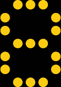
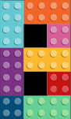
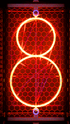
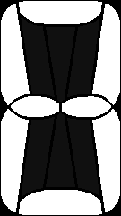
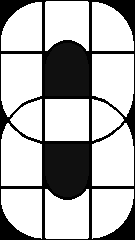
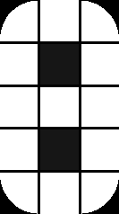
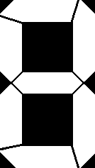
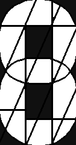
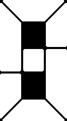
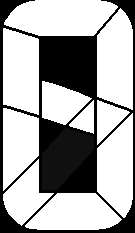

# Clock Faces for IPS Tube Clocks

Files "ready to use" for the firmware of judge2005 can be found in the respective font folder. Simply download the *.tar.gz and upload it in the web interface of the clock. All files have been tested with a NovelLife watch.

Firmware: https://github.com/judge2005/EleksTubeIPS

All Fonts are from https://fonts.google.com/

## Better Defaults
Improved versions of the default watch faces which are supplied with the judge2005 firmware. In most cases am/pm/colon/space images have been added and the watch face has been cleaned up. The clock faces have also been added to the firmware and will be included as default in the next release. Currently, these still have to be replaced manually.

dots_yellow | flip_clock [(Bebas Neue)](https://fonts.google.com/specimen/Bebas+Neue) | lego | original
-------- | -------- | -------- | --------
 |  |  |  |
ribbon_blue | rounded_pink | seven_segment_red |
 |  |  |

## Segmented Style Faces (WIP)
Ideas from [michieldb.nl](http://www.michieldb.nl/other/segments/) - Big thanks!

Some watch faces are also available in other colors.

14 | 3x5_Matrix_1 | 3x5_Matrix_2 | 9 | Classic
-------- | -------- | -------- | -------- | --------
 |  |  |  |  
Double_Bubble | Half_Bubble_17 | No_Compromise | Seamless_Regular | Seamless_Round
 |  |  |  |  
Seamless_Tangram | Solid_11 | Sports | Sports_9 | Ugly
 |  |  |  |  
Verticals_Priority_Asym | Verticals_Priority_Sym | X_13 | X_Light_15
 |  |  |  | 

## Selfmade Faces

Ice [(Code Mono)](https://fonts.google.com/specimen/Kode+Mono) |
-------- |
 |

## Simple Font Faces
[Quantico](https://fonts.google.com/specimen/Quantico) | [Texturina](https://fonts.google.com/specimen/Texturina) | [Warnes](https://fonts.google.com/specimen/Warnes)
-------- | -------- | --------
 |  | 
