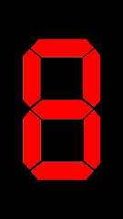

# Clock Faces for IPS Tube Clocks

Files "ready to use" for the firmware of judge2005 can be found in the respective font folder. Simply download the *.tar.gz and upload it in the web interface of the clock. All files have been tested with a NovelLife watch.

The folder "Better_Defaults" contains improved versions of the standard watch faces which are supplied with the judge2005 firmware. In most cases am/pm/colon/space images have been added and the watch face has been cleaned up. The clock faces have also been added to the firmware and will be included as default in the next release. Currently, these still have to be replaced manually.

Firmware: https://github.com/judge2005/EleksTubeIPS

# Better Defaults

dots_yellow

flip_clock

lego

original

ribbon_blue

rounded_pink

seven_segment_red

# Font sources
Fonts are from https://fonts.google.com/

## Better Defaults
* Bebas Neue (AM/PM Flip Clock): https://fonts.google.com/specimen/Bebas+Neue

## Selfmade Faces
* Code Mono (Ice): https://fonts.google.com/specimen/Kode+Mono

## Simple Font Faces
* Quantico: https://fonts.google.com/specimen/Quantico
* Texturina: https://fonts.google.com/specimen/Texturina
* Warnes: https://fonts.google.com/specimen/Warnes

## Segment Style Faces (WIP)
Ideas from http://www.michieldb.nl/other/segments/

Big thanks!